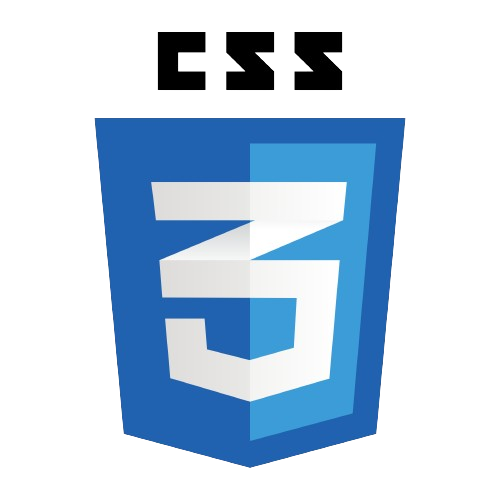
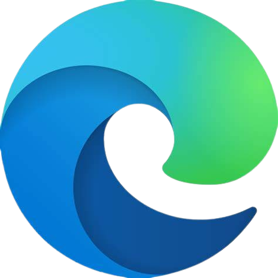

<!---[](https://holopin.io/@shouryabrahmastra)--->


##  <div align="center"></div>
### Hi there, I'm Shourya Gupta   - aka [ShouryaBrahmastra](https://shourya-portfolio.netlify.app/) <br>
[](https://www.linkedin.com/in/shourya-gupta-12911721b/)

<p align="center">
	<a href="https://github.com/DenverCoder1/readme-typing-svg"></a>
</p>
 <p align="center"></p>
 <br>
	


## I'm a Student as well as Frontend and Backend Developer!!  

- 🌱 I’m currently learning everything 😎
	
-  I’m looking to collaborate with other content creators
	
- 🥅 Goals: Contribute more to Open Source projects
- ⚡ Fun fact: I love to draw, play volleyball🏐 & play video games🎮
	

## Connect with me:
<p align="center">
	<a href="https://www.linkedin.com/in/shourya-gupta-12911721b/" target="_blank">
		
	</a>
	<a href="https://twitter.com/Shourya_Nishi" target="_blank">
		
	</a>
	<a href="t.me/shouryabrahmastra" target="_blank">
		
	</a>
	<a href="https://www.instagram.com/shouryagupta2002/" target="_blank">
		
	</a>
	<a href="mailto:gptshourya02@gmail.com" target="_blank">
		
	</a>
</p>

---

## 🔧Languages and Tools:

<p align="center">
	
	
	
	
	
	
	
	
	
	
	
	
	<br>
	
	
	
	
	
	
	
	
	
	
	
	
	<br>	
	
	
	
	
	
		
			
	
	
	
	
	
	
	
	<br>
	
	
	
	
	
	
	
	
	
	
	
	<br>
	
	
	
	
	
	
	
	
	
	<br>
	
	
	
	
	
	
	
	<br>
	<!---
	
	
	
	
	<br>
	
	
	
	
	
	
	
	
	
	
	
	
	
	
	
	
	--->
</p>


<!---
[](https://git.io/streak-stats)--->


---

## 📚📂 My Works

<p align="center">
	
</p1>
<!---<p>--->

- [1st Frontend website](https://shouryabrahmastra.github.io/Frontend-first-website/)
- [Online-Calendar](https://shouryabrahmastra.github.io/onlinecalendar/)
- [Digital responsive clock](https://shouryabrahmastra.github.io/LampTime-Date/)
- [Threat Analyzer Vulnweb_Detailed_Report ](https://shouryabrahmastra.github.io/Vulnweb_Detailed_Report/)
- [Durga Puja](https://shouryabrahmastra.github.io/Durga-Puja/)
- [Personal Jamboard](https://shouryabrahmastra.github.io/Personal-Jamboard/)
- [Music App](https://music-app-sg.netlify.app/)
- [Netflix Clone](https://netfix-clone-b5812.web.app/)
- [Gym Ui/UX](https://gym-landing-sg.netlify.app/)

---
## 🏆 GitHub Trophies
 <a href="https://github.com/ryo-ma/github-profile-trophy"></a> 

---
## GitHub Stats
<p align="center">
	<a href="https://git.io/streak-stats"></a>
</p>
<br>
<p align="center">
  <a href="https://github.com/ShouryaBrahmastra">
	  
	  <br>
	  
	  
	  
	  
  </a>
</p>
<br>


---

## 😍😍 Views and Followers ❤❤ <br> <br>
<a href="https://github.com/Meghna-DAS/github-profile-views-counter">
    
</a>
<a href="https://github.com/ShouryaBrahmastra?tab=followers"></a>


<br/>
<br/>

---
## ✍️ Random Dev Quote
<p align="center">
	
</p>


---

## Open Source Contribution Snapshot
```mermaid
flowchart LR
    Fork[Fork the project]-->branch[Create a New Branch]
    branch-->Edit[Edit file]
    Edit-->commit[Commit the changes]
    commit -->|Finally| creatpr((Create a Pull Request))
    
 ```

## Contribution Graph
[](https://github.com/ShouryaBrahmastra/github-readme-activity-graph)

<div align="center">
<p>Feel free to express something about my works in my guest book:</p>
<a href="https://github.com/ShouryaBrahmastra/ShouryaBrahmastra/issues/1"></a>
</div>

<hr>
<div  align="center"> </div>


---
<div  align="center">
	
</div>


